# Desafio BB Experimente de Computação Afetiva

## Qual desafio
Desenvolver um algoritmo de análise de sentimentos a partir de imagens faciais de brasileiros utilizando Inteligência Artificial e Processamento de Imagens.

## Como acessar

1. Acesse o [link](http://analitica.big.intranet.bb.com.br) da Plataforma Analítica. Entre com chave e senha do SISBB:

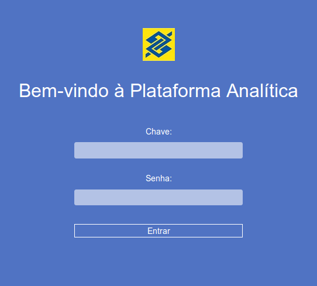

2. Selecione no menu lateral a opção Projetos ->  Novo Projeto:

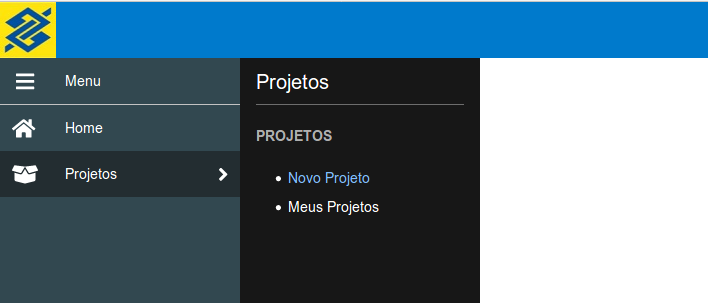

3. Selecione a opção que permite uso do **pip**:

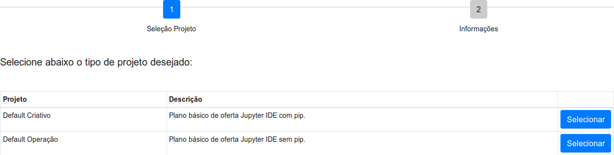

4. Dê um nome ao seu projeto e clique em **Salvar**:

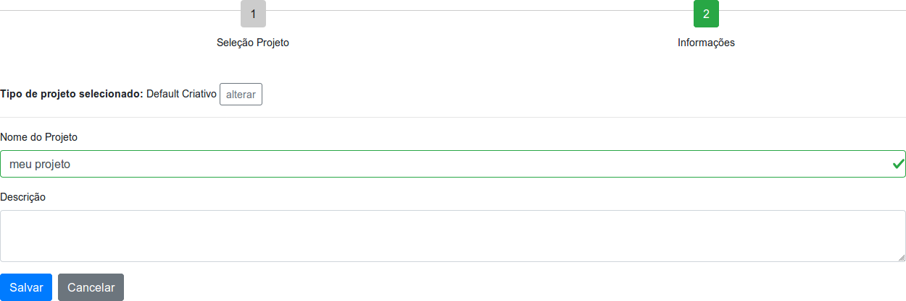

5. Aguarde até que o estado do projeto esteja **Ativo** (cerca de 2 minutos) e clique no botão **Abrir** que irá aparecer:

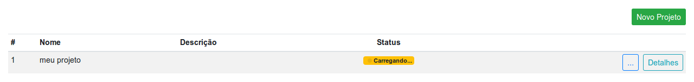

6. Será aberto editor Jupyter Lab. Crie um notebook clicando no **ícone Python 3**, na aba Launcher:

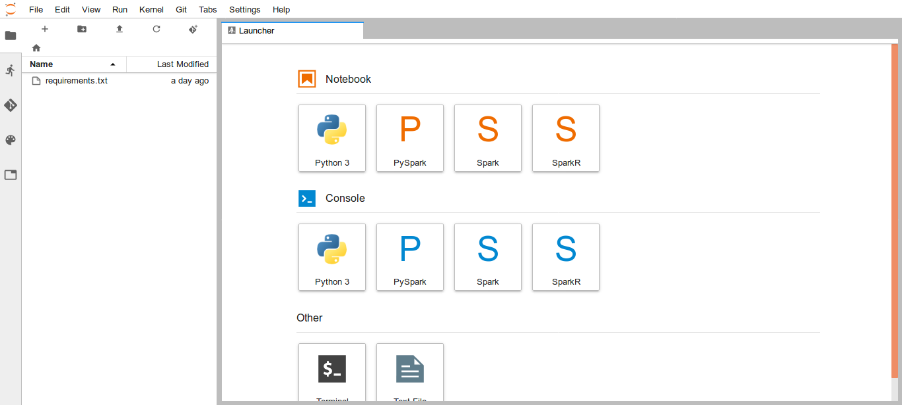

7. Você pode instalar as bibliotecas necessárias com o comando 

```sh

!pip install <biblioteca> --user

```

e teclando *Ctrl+Enter* na célula.

Exemplo:

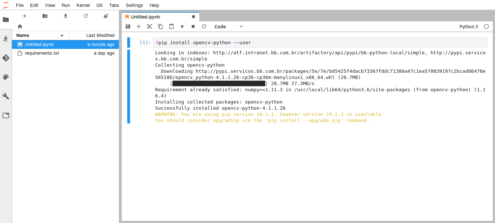


## Aonde consigo materiais para me ajudar
É possível encontrar materiais de apoio no site da OpenCV (https://opencv.org/) e no site da Dlib (http://dlib.net).
No site da OpenCV pode-se encontrar algoritmos de detecção facial, por exemplo em https://docs.opencv.org/3.4/db/d28/tutorial_cascade_classifier.html, ou em sites de terceiros como https://towardsdatascience.com/face-detection-in-2-minutes-using-opencv-python-90f89d7c0f81, que serão necessários para detectar as faces nas imagens.
 
No site da dlib pode-se também detectar faces e pontos "especiais" (canto dos olhos, da boca, etc.) a fim de determinar se a pessoa está sorrindo, por exemplo (vide http://dlib.net/face_landmark_detection.py.html).   
 
Vale consultar o Google!
 
A base de imagens faciais de brasileiros para a configuração/treinamento de seu método está disponível na Plataforma Analítica. Cada pessoa da base possui uma pasta com cinco imagens, cada uma delas contendo uma imagem facial exibindo um dos 5 principais sentimentos a ser analisados: neutro, feliz, triste, surpreso e bravo. As imagens de cada indivíduo já estão nomeadas nesta ordem para facilitar sua identificação, por exemplo, a imagem "s001-00_img.bmp" ilustra a pessoa s001 com a face neutra; a imagem  "s001-01_img.bmp" ilustra a pessoa s001 com a face feliz; a "s001-02_img.bmp" com a face triste; a "s001-03_img.bmp" com a face surpresa; e a "s001-04_img.bmp" com a face brava.

Utilizem a imaginação e as bibliotecas disponibilizadas para extrair as melhores características e classificar o máximo de imagens corretamente.

Obs: A base de dados fornecida é exclusivamente para pesquisa. Não a utilize para fins comerciais.

## Aonde e como entregar
A entrega do desafio será feita por meio do **fork** deste repositório. Para isso, siga as seguintes instruções:

1) Logue na sua conta do Github e em seguida acesse o repositório do [desafio BB](https://github.com/experimenteBB/desafioBBCpuAfetiva). Na página do repositório, clique no botão "**Fork**" localizado no canto superior direito da página:

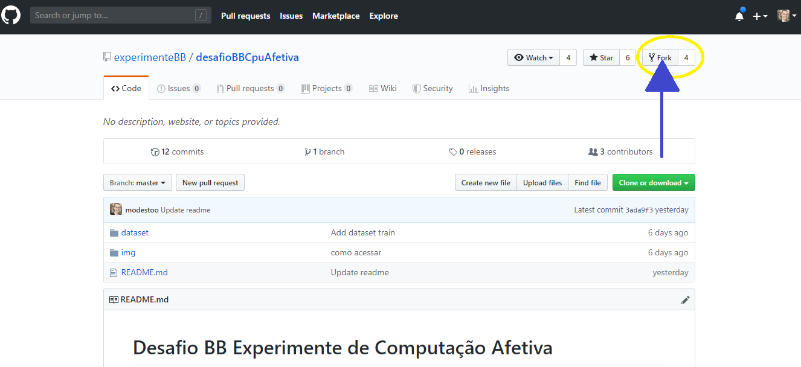

2) Uma nova tela será aberta. Selecione a sua conta do GitHub para iniciar o fork do repositório:

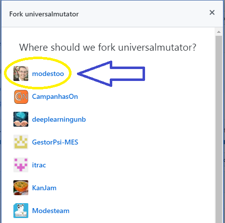

3) Uma cópia do repositório será feita para seu usuário. Aguarde por alguns minutos. A figura a seguir é exibida enquando o GitHub cria uam cópia para você.

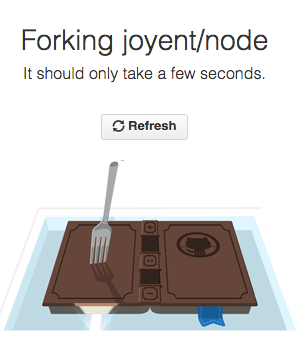

4) Quando o **fork** do repositório for concluído, você será redirecionado automaticamente para a cópia do repositório na sua conta do GtiHub. Para confirmar que a cópia foi feita corretamenta observe o status do repositório no canto superior esquerdo da página. O status conterá a mensagem: *forked from experimenteBB/desafioBBCpuAfetiva*, conforme figura a seguir:

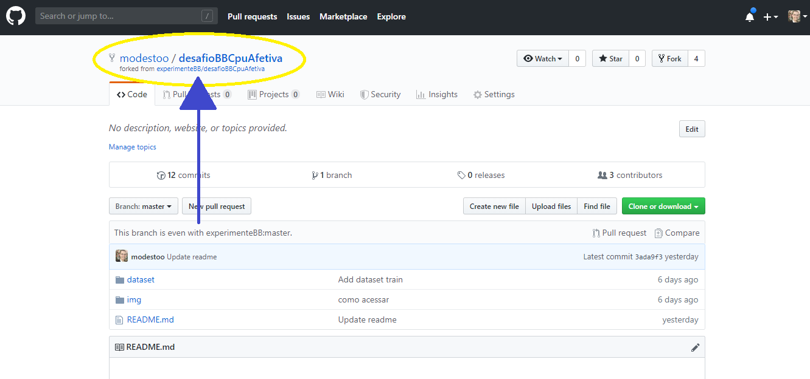

5) Quando você finalizar as modificações em seu código e quiser submeter para avaliação, selecione o botão "**New pull request**":

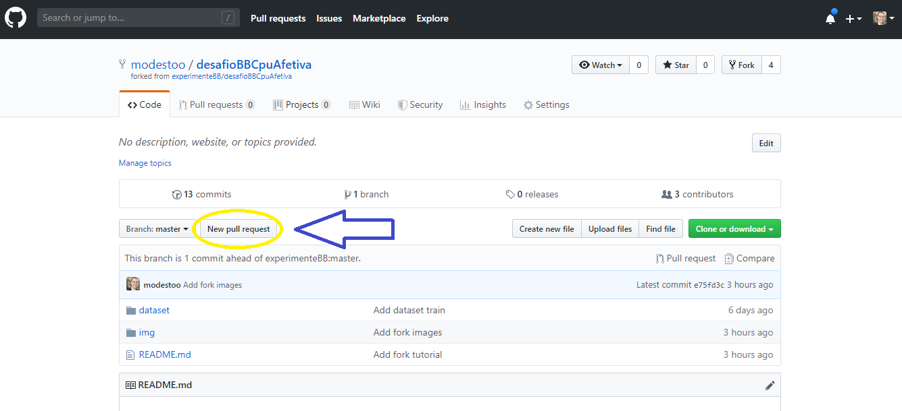

6) Na tela seguinte, será apresentado a você um comparativo das modificações que foram realizadas em todos os arquivos que você editou, adicionou ou excluiu. Confira se as modificações estão corretas e aperta o botão "**Create pull request**":

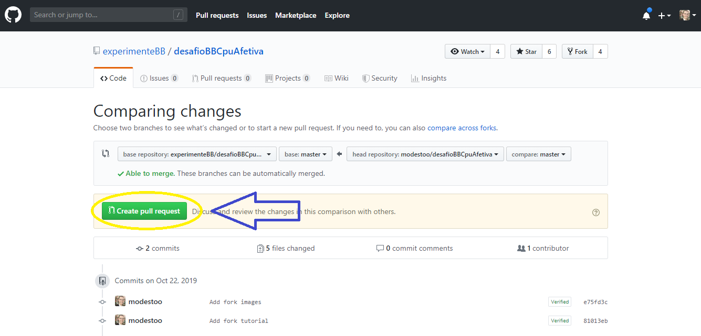

7) Agora você deve dar um título ao seu *pull request*. Insira um título significativo, como no exemplo da imagem a seguir. E depois aperto no botão "**Create pull request**":

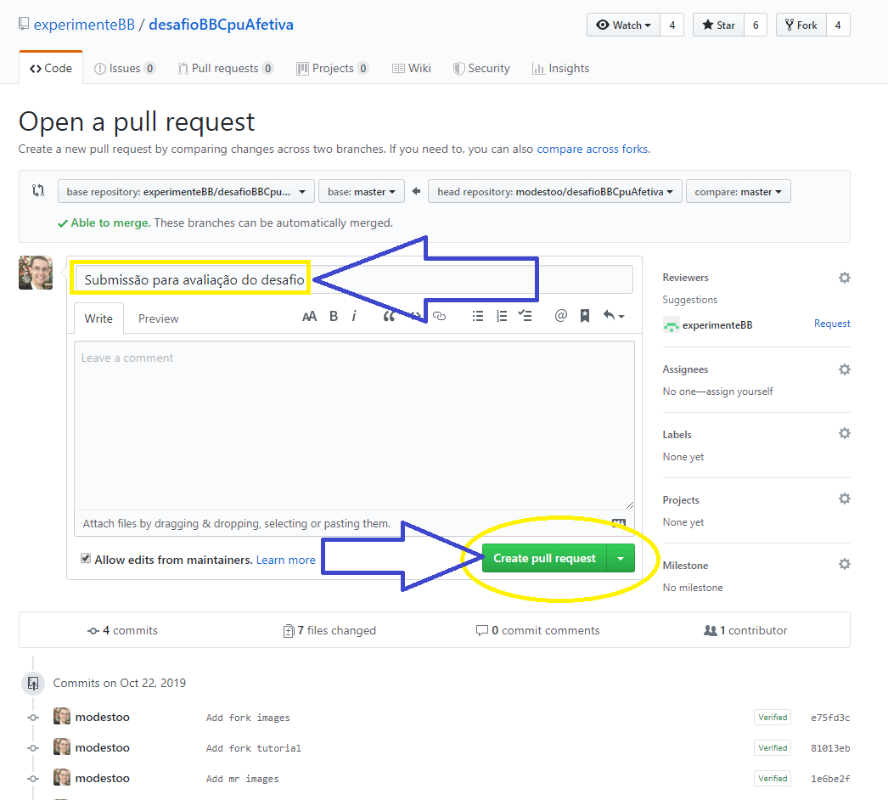

8) PRONTO!!! Seu código foi encaminhado para nós, conforme na imagem a seguir. Você ainda pode continuar programando e submetendo novas versões. Fique a vontade para isso!


Quanto à forma de entrega, você deverá criar um script chamado main_predict.py. Neste script, deve haver uma função *main()* que receberá uma imagem como parâmetro e retornará um número correspondente a emoção da face presente na imagem, senda elas: 0-neutra; 1-feliz; 2-triste; 3-surpreso; e 4-bravo.

Você pode projetar seu modelo de classificação da forma que achar mais adequada, use a criatividade para isso. E lembre-se de criar um script para que possamos testar seu modelo em outras bases. 

Após estes passos encaminhe o link do pull request e user do github para ditec.gesti.inovacao@bb.com.br
Ex: User github rnmourao, link https://github.com/experimenteBB/desafioBBCpuAfetiva/pull/1

Avaliaremos seu código e testaremos script em outra base de imagens faciais brasileiras, com as mesmas expressões faciais, para vermos quão robusto ele é (isto é, quantas faces/expressões são classificadas corretamente na nossa base de teste) e divulgaremos, ao final do evento, o resultado na Plataforma.

Bom trabalho!
